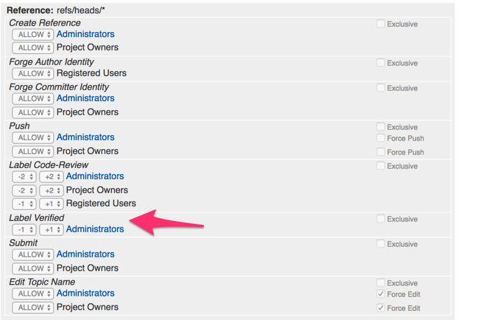

# Jenkins CI with Rancher-Server

This document explains the setup of a rancher-server cluster running a complete CI environment consisting 
of:

* a gerrit SCM (git) server (if you arenot familiar with gerrit, think of it as a private github server)
* a jenkins CI/CD server (your private travis.ci server)
* a nexus repository server (aka your private maven central) which can mirror maven artifacts and also serve as a private docker registry

Please also see the accompanying other github repositories

* rancherci-seed
* rancherci-webshop

# Basic Setup

2. Setup VMs

        cd 01-setupvms
        ./01-create-vms.sh
        
   please check `/etc/hosts` whether the new hosts have been added , otherwise add them manually
   
   		docker-machine ip rancher-server
   		docker-machine ip rancher-agent-01
   		
	make sure that entries for rancher-server.shared, rancher-server 
	
		10.211.55.13   	rancher-server.shared rancher-server
		10.211.55.14   	rancher-agent-01.shared rancher-agent-01
		
        
2. create the local docker registry for pre-caching all images (only for presentation)

  		./02-01-start-presentation-registry.sh

3. ~~cache images that we will need (optional)~~ (not needed when using presentation registry)

	~~./03-01-prepull-images.sh~~
		
4. start registry gui (just to see whats in there)

		./03-02-start-registry-gui
		
	open [http://rancher-server:9000/](http://rancher-server:9000/) to check the local presentation registry
	
4. start rancher-server

		./04-start-rancher-server.sh
		
5. add rancher-agent

		./05-add-rancher-agent.sh
		
	this will open a web browser with the correct commandline, copy it to the file `06-start-rancher-agent.sh` and make the following changes: 
	  1. remove the `sudo` as this is not necessary on mac with `docker-machine`
	  2. add `rancher-server:5000` before `rancher/agent:v1.2.2` in order to make it download from our 
	     cache registry
	  3. once this is done execute the updated script
	  
	        ./06-start-rancher-agent.sh
	
6. setup api keys

		./07-setup-api-key.sh
		
	this will open a web browser and navigate to the "Add api key" page on your server
	 * choose the following values
	 * name: `rancher-cli`
	 * description: `access the server via cli`
	 * now copy the key 
	
7. download rancher CLI `brew install rancher-cli`, or directly download from

	[https://github.com/rancher/cli/releases](https://github.com/rancher/cli/releases)

8. setup rancher CLI

		rancher config 
		
	* URL: `http://rancher-server:8080`
	* keys: here you have to enter the secrets that you have set up in step 6
	
9. build the rancher-cli docker image

		cd ../../container/rancher-cli-configured
		
	1. update the access keys you have copied from the web page
	2. build the container and push it to our demo registry

			./build.sh
			./push.sh
			
				
# Setup Infrastructure stacks

## Nexus

1. start the nexus stack (already contains all config)

		cd ../stacks/repository-nexus
		rancher up -d
		
2. once the registry is up you can log into it from all your nodes

		./docker-login.sh

3. create a `jenkins` user 
 	* username: jenkins
 	* password: password
 	* role : Admin

 	Usually you would use the credentials from active directory / LDAP but for the demo we make it quick
 	
4. add the nexus repository to the rancher UI

	[http://rancher-server.shared:8080/env/1a5/infra/registries](http://rancher-server.shared:8080/env/1a5/infra/registries)
	
## Gerrit

1. launch the stack

		cd ../gerrit
		rancher up -d
		
	Note that usually you would launch gerrit with the parameters for LDAP auth, for more info, check: 
	[https://github.com/openfrontier/docker-gerrit](https://github.com/openfrontier/docker-gerrit)
		
2. add your `.ssh/id_rsa.pub` to the admin ssh key list

	[http://rancher-agent-01.shared:8082/#/settings/ssh-keys](http://rancher-agent-01.shared:8082/#/settings/ssh-keys)
	
2. create a jenkins user with SSH key and projects

		./create-projects.sh
	
3. setup verified permission for admin group on "all projects"
 	1. add verified label (for more info check the [Documentation about "Verified" label](https://gerrit-review.googlesource.com/Documentation/config-labels.html#label_Verified)

		[http://rancher-agent-01.shared:8082/#/admin/projects/All-Projects](http://rancher-agent-01.shared:8082/#/admin/projects/All-Projects)
		
		Click on "Edit Config"
		 
			[label "Verified"]
		      function = MaxWithBlock
		      value = -1 Fails
		      value =  0 No score
		      value = +1 Verified
 	
 	2. now click on "Access" to add the permission to reference `refs/heads/*`
 	
   		
   		
4. finally push the following projects to gerrit
	* `rancher-jenkins-seed-jobs` (ssh://admin@rancher-agent-01:29418/demo/rancher-jenkins-seed-jobs)
	* `demo_webshop` (ssh://admin@rancher-agent-01:29418/demo/webshop)
		
## Jenkins

0. in order to launch Jenkins we need the SEED repo, TODO
	> (?) on gerrit or github?

1. launch jenkins

		cd ../jenkins
		rancher up -d

2. go to jenkins web UI and launch the seed job

	[http://rancher-agent-01.shared:8083/](http://rancher-agent-01.shared:8083/)
	

# Further reading
* http://rancher.com/deploying-a-scalable-jenkins-cluster-with-docker-and-rancher/
* http://rancher.com/tag/jenkins/
* http://rancher.com/docker-based-build-pipelines-part-1-continuous-integration-and-testing/

More details can be found at [Lanyrd](http://lanyrd.com/2017/spring-io/sfqtth/).